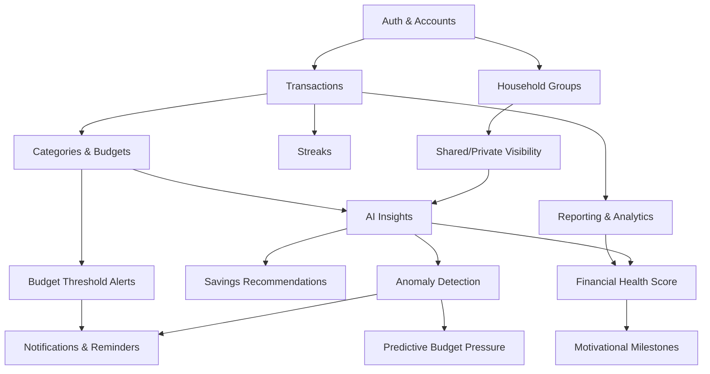

# 02 - Requirements

Document Version: 2.0  
Product Name: FinanceTracker  
Last Updated: June 2026

---

## 1. Purpose

This document serves as the single source of truth for FinanceTracker's functional and non-functional requirements.

It defines what the product must do, the quality attributes it must satisfy, and the implementation priorities for each development milestone.

All architecture, database design, API specifications, testing, and implementation decisions should trace back to the requirements defined in this document.

---

## 2. Scope

### In Scope (V1)

- Secure user authentication and account lifecycle
- Transaction logging for income and expenses
- Categories, budgets, and budget progress tracking
- Household groups with role-based access
- Shared and private transaction visibility
- AI-generated summaries, spending insights, and recommendations
- Predictive alerts for budget pressure and anomalies
- Financial Health Score and habit engagement mechanics
- Daily/weekly/monthly/yearly reporting views

### Out of Scope (V1)

- Direct bank integrations
- UPI synchronization
- Investment and crypto tracking
- Tax filing workflows
- Multi-currency support
- OCR receipt scanning
- Voice entry
- Full conversational AI assistant
- Native mobile applications
- Loan and debt management

---

## 3. Development Roadmap

| Milestone | Theme | Goal |
| --- | --- | --- |
| **Milestone 1** | Core Foundation | Build a complete household finance platform without AI dependency. |
| **Milestone 2** | Intelligent Finance | Add AI-driven insights, recommendations, and predictive financial guidance. |
| **Milestone 3** | Financial Operating System | Expand into automation, conversational AI, integrations, and cross-platform experiences. |

### Milestone 1 — Core Foundation

Focus: Build a complete, usable household finance platform. Validate retention and value through frictionless tracking and collaboration.

| Area | Deliverables |
| --- | --- |
| Auth | Email/password registration, login, logout, password reset |
| User Profiles | Name, timezone, preferences, email verification |
| Transactions | Income and expense CRUD, history, filters, search |
| Categories | Create, edit, archive spending categories |
| Budgets | Monthly category budgets, real-time usage, threshold alerts |
| Household | Groups, role-based permissions, shared/private visibility |
| Dashboard | Summary view of spending, income, and budget status |
| Reporting | Period dashboards, category trends |
| Engagement | Streaks and progress indicators |

### Milestone 2 — Intelligent Finance

Focus: Layer AI-driven intelligence on top of the financial data captured in Milestone 1.

| Area | Deliverables |
| --- | --- |
| AI Insights | Weekly/monthly summaries, spend-change explanations |
| Savings Recommendations | Concrete action plans tied to spending patterns |
| Anomaly Detection | Unusual spending flagging and risk alerts |
| Budget Prediction | Near-term budget pressure forecasting |
| Notifications | Behavior-based reminders, anomaly alerts, preference controls |
| Financial Health Score | Composite score with transparent factor breakdown |
| Goal Tracking | Savings progress views, period comparisons |
| Engagement | Motivational milestones |

### Milestone 3 — Financial Operating System

Focus: Reduce manual input, expand automation, and grow into a cross-platform financial ecosystem.

| Area | Deliverables |
| --- | --- |
| AI Assistant | Conversational financial assistant, deeper planning |
| Automation | OCR receipt scanning, voice entry, bill prediction |
| Recurring Transactions | Auto-generated entries for salary, rent, subscriptions, EMIs |
| Subscription Detection | Identify and track recurring subscription patterns |
| Integrations | Bank connectivity, UPI sync, external data imports |
| Platform | Multi-currency support, offline sync, goal optimizer |
| Mobile | Native mobile applications |

---

## 4. Functional Requirements

### Functional Modules

FinanceTracker is organized into the following functional modules:

| Module | Description |
| --- | --- |
| Authentication | User registration, login, and account security |
| User Profile | Personal preferences and account settings |
| Transactions | Income and expense management |
| Categories | Income and expense categorization |
| Budgets | Budget planning and monitoring |
| Household | Shared finance and collaboration |
| Dashboard | Financial overview and quick actions |
| Reporting | Historical analysis and trends |
| AI Insights | Intelligent recommendations and predictions |
| Notifications | Alerts and reminders |
| Settings | Application preferences |
| Data Export | Exporting user financial data |

Priority legend: `P0` = must-have for launch, `P1` = should-have for launch quality, `P2` = can be phased after core launch.

### 4.1 Authentication and Account Management

- `FR-AUTH-001 (P0)` Users must be able to register with email and password.
- `FR-AUTH-002 (P0)` Users must be able to log in and log out securely.
- `FR-AUTH-003 (P0)` Users must be able to reset forgotten passwords via verified recovery flow.
- `FR-AUTH-004 (P1)` Users must be able to verify email addresses before full account activation.
- `FR-AUTH-005 (P1)` Users must be able to manage profile details (name, timezone, default currency for display, preferences).

### 4.2 Transaction Logging and Management

- `FR-TXN-001 (P0)` Users must be able to create expense transactions with amount, date, category, and optional notes.
- `FR-TXN-002 (P0)` Users must be able to create income transactions with amount, date, source/category, and optional notes.
- `FR-TXN-003 (P0)` Users must be able to edit and delete their transactions.
- `FR-TXN-004 (P0)` Users must be able to view transaction history in reverse-chronological order.
- `FR-TXN-005 (P1)` Users must be able to filter transactions by date range, category, type (income/expense), and household context.
- `FR-TXN-006 (P1)` Users must be able to search transactions by keyword (notes/category/source).
- `FR-TXN-007 (P1)` Users must be able to mark transactions as shared or private where applicable.

### 4.3 Category and Budget Management

- `FR-BUD-001 (P0)` Users must be able to create, edit, and archive spending categories.
- `FR-BUD-002 (P0)` Users must be able to create monthly budgets by category.
- `FR-BUD-003 (P0)` Users must be able to view real-time budget usage and remaining amount.
- `FR-BUD-004 (P1)` Users must be able to set household-level shared budgets.
- `FR-BUD-005 (P1)` Users must be able to configure threshold levels for alerts (for example: 80%, 100%, 120%).

### 4.4 Household Collaboration and Permissions

- `FR-HH-001 (P0)` Users must be able to create a household group.
- `FR-HH-002 (P0)` Household owners/admins must be able to invite members.
- `FR-HH-003 (P0)` System must support role-based permissions (for example: owner, member, viewer).
- `FR-HH-004 (P0)` Users must be able to designate entries as shared or private.
- `FR-HH-005 (P1)` Household members must be able to view combined household metrics based on permissions.
- `FR-HH-006 (P1)` Household admins must be able to remove members and update member roles.

### 4.5 AI Insights and Decision Support

The AI module enhances the user experience by analyzing financial data and generating actionable insights. AI features are introduced after the core finance platform is stable and sufficient historical data has been collected.

- `FR-AI-001 (P1)` The system shall generate plain-language weekly and monthly financial summaries based on a user's income, expenses, budgets, and spending trends.
- `FR-AI-002 (P1)` The system shall identify and explain significant spending changes by comparing the current period with previous comparable periods.
- `FR-AI-003 (P1)` The system shall provide personalized savings recommendations based on user spending patterns, budget utilization, and recurring financial behavior.
- `FR-AI-004 (P1)` The system shall detect unusual or potentially anomalous spending patterns and notify users when abnormal financial activity is identified.
- `FR-AI-005 (P1)` The system shall predict near-term budget pressure and estimate the likelihood of exceeding active budgets before the end of the selected budget period.
- `FR-AI-006 (P1)` Every AI-generated insight shall include a concise explanation describing the factors that contributed to the recommendation or prediction.
- `FR-AI-007 (P1)` AI-generated insights shall be available for both individual users and household-level financial data, subject to household roles and privacy permissions.
- `FR-AI-008 (P1)` The system shall allow users to manually regenerate AI insights after new financial data has been added.
- `FR-AI-009 (P1)` The system shall clearly indicate when AI insights are unavailable due to insufficient historical data or temporary service interruptions.

### 4.6 Notifications and Reminders

- `FR-NOTIF-001 (P0)` System must notify users when a budget reaches configured thresholds.
- `FR-NOTIF-002 (P1)` System must send periodic reminders to log missed transactions.
- `FR-NOTIF-003 (P1)` System must generate alerts for anomalous or high-risk spending patterns.
- `FR-NOTIF-004 (P1)` Users must be able to control reminder preferences and channels available in V1.

### 4.7 Reporting and Analytics

- `FR-REP-001 (P0)` Users must be able to view summary dashboards for daily, weekly, monthly, and yearly periods.
- `FR-REP-002 (P0)` Users must be able to see category-wise spending trends over time.
- `FR-REP-003 (P1)` Users must be able to compare current-period spending against previous periods.
- `FR-REP-004 (P1)` Users must be able to view savings progress and goal progress summaries.

### 4.8 Engagement and Financial Health

- `FR-ENG-001 (P1)` System must compute and display a Financial Health Score.
- `FR-ENG-002 (P1)` System must show streaks and progress indicators tied to consistent logging.
- `FR-ENG-003 (P2)` System should provide motivational milestones (for example: first full month under budget).

### 4.9 Dashboard

- `FR-DASH-001 (P0)` The system shall provide a personalized dashboard displaying current income, expenses, budget utilization, savings, recent transactions, and household financial summary.
- `FR-DASH-002 (P0)` The dashboard shall automatically reflect changes whenever financial data is created, updated, or deleted.
- `FR-DASH-003 (P1)` Users shall be able to customize dashboard widgets, layout, and displayed metrics in future versions.
- `FR-DASH-004 (P1)` The dashboard shall provide quick access to frequently used actions such as adding income, adding expenses, creating budgets, and viewing reports.

### 4.10 Settings

- `FR-SET-001 (P1)` Users shall be able to switch between light and dark themes.
- `FR-SET-002 (P1)` Users shall be able to configure notification preferences, including reminder frequency, notification channels, and quiet hours.
- `FR-SET-003 (P1)` Users shall be able to configure their preferred display currency.
- `FR-SET-004 (P1)` Users shall be able to configure their timezone and regional preferences.
- `FR-SET-005 (P1)` Users shall be able to permanently delete their account and associated personal data.
- `FR-SET-006 (P1)` Users shall be able to update profile information such as name and profile picture.
- `FR-SET-007 (P2)` Users shall be able to manage connected household memberships and leave a household when permitted.

### 4.11 Data Export

- `FR-EXP-001 (P1)` Users shall be able to export transaction history as a CSV file.
- `FR-EXP-002 (P2)` Users shall be able to export financial reports as PDF documents.
- `FR-EXP-003 (P2)` Exported files shall respect user permissions and exclude private household data that the requesting user is not authorized to access.

---

## 5. Non-Functional Requirements

### 5.1 Performance

- `NFR-PERF-001` Core dashboard pages should load in under 2.5 seconds on standard broadband for typical datasets.
- `NFR-PERF-002` Transaction create/update operations should complete in under 500 ms for normal load.
- `NFR-PERF-003` System should support smooth interaction for at least 100k stored transactions per tenant with pagination and indexing.

### 5.2 Availability and Reliability

- `NFR-REL-001` Target production uptime should be at least 99.5% monthly for V1.
- `NFR-REL-002` Critical background jobs (notifications, AI summaries) must include retry logic and failure logging.
- `NFR-REL-003` Backups must run regularly with tested restore procedures.

### 5.3 Security and Privacy

- `NFR-SEC-001` All sensitive data in transit must use TLS.
- `NFR-SEC-002` Passwords must be stored using strong one-way hashing.
- `NFR-SEC-003` Role-based access control must be enforced at both API and data layers.
- `NFR-SEC-004` Users must not be able to access private household entries without explicit permission.
- `NFR-SEC-005` System must maintain auditable records for authentication and high-risk account actions.

### 5.4 Scalability and Maintainability

- `NFR-SCALE-001` Architecture must be modular to support future integrations and AI expansion.
- `NFR-SCALE-002` APIs must be versionable to allow backward-compatible evolution.
- `NFR-MAIN-001` Codebase must follow consistent linting, formatting, and documentation standards.
- `NFR-MAIN-002` Requirements-to-feature traceability must be maintained in project documentation.

### 5.5 Usability and Accessibility

- `NFR-UX-001` Core transaction logging flow should be completable in minimal steps to reduce drop-off.
- `NFR-UX-002` Interface must remain fully responsive for desktop and mobile web layouts.
- `NFR-UX-003` Primary user journeys should follow accessibility best practices (semantic structure, keyboard support, readable contrast).

### 5.6 Observability and Operations

- `NFR-OPS-001` System must capture structured logs for API errors, auth events, and background jobs.
- `NFR-OPS-002` Monitoring and alerting must be configured for service health and critical failures.
- `NFR-OPS-003` Release workflows must support rollback in case of production regressions.

---

## 6. Business Requirements

- `BR-001` The product must deliver clear value within the first week by reducing tracking friction and showing actionable insights.
- `BR-002` The product must improve user retention beyond the first month through engagement loops and reminders.
- `BR-003` The platform must support both individual and household use cases as first-class workflows.
- `BR-004` AI features must be meaningfully differentiated from generic summaries and tied to concrete financial actions.
- `BR-005` Architecture and documentation must be production-oriented to support SaaS growth.
- `BR-006` V1 must validate core behavior-change outcomes (tracking consistency, budget adherence, savings progress) before expanding scope.

---

## 7. User Stories

### Authentication and Profile

- As a new user, I want to sign up quickly so that I can start tracking finances without setup friction.
- As a returning user, I want secure login and password recovery so that I can access my data reliably.
- As a user, I want to manage profile preferences so that reports and reminders match my context.

### Transactions and Budgets

- As a user, I want to log income and expenses in seconds so that I stay consistent every day.
- As a user, I want to categorize transactions so that my spending patterns are understandable.
- As a user, I want category budgets so that I can prevent overspending before month-end.
- As a user, I want to review and search past transactions so that I can verify and correct entries.

### Household Collaboration

- As a household owner, I want to invite members with roles so that responsibilities are clearly shared.
- As a household member, I want to view shared budgets and metrics so that we can coordinate spending.
- As a user, I want private entries to remain private so that I maintain financial boundaries.

### AI and Decision Support

- As a user, I want plain-language weekly/monthly summaries so that I understand my financial direction quickly.
- As a user, I want explanations for spending changes so that I know what caused budget drift.
- As a user, I want specific savings recommendations so that I can take immediate action.
- As a user, I want anomaly and overspend warnings so that I can react before problems compound.

### Engagement and Reporting

- As a user, I want trend reports across periods so that I can evaluate whether habits are improving.
- As a user, I want a Financial Health Score and streaks so that I stay motivated and consistent.

---

## 8. Acceptance Criteria

### 8.1 Authentication

- Users can sign up, log in, and log out successfully.
- Invalid credentials are rejected with safe error messaging.
- Password reset flow issues a secure token and allows successful reset.

### 8.2 Transaction Management

- User can create income/expense transactions with required fields.
- Transactions appear immediately in history and relevant summaries.
- User can edit or delete own transactions with changes reflected in totals.
- Filters and search return accurate transaction subsets.

### 8.3 Budgets

- User can create monthly category budgets.
- Budget usage updates automatically when linked transactions change.
- Alerts trigger at configured thresholds.

### 8.4 Household Collaboration

- Household owner can invite members and assign roles.
- Access rules correctly restrict actions based on role.
- Private transactions are hidden from unauthorized members.
- Shared dashboards display household-level totals correctly.

### 8.5 AI Insights

- Weekly and monthly AI summaries are generated for active users.
- Spend-change explanations identify major contributing categories.
- Recommendations contain at least one clear action statement.
- Anomaly and budget-pressure alerts are generated when risk conditions are met.

### 8.6 Reporting and Engagement

- User can access daily/weekly/monthly/yearly summaries.
- Category trends and comparison views render correct period data.
- Financial Health Score displays with a transparent factor breakdown.
- Streak indicators update based on logging activity.

### 8.7 Non-Functional Quality Gates

- Core pages meet defined performance thresholds under expected load.
- Authorization checks pass security tests for private/shared boundaries.
- Critical workflows are covered by automated tests and pass in CI.
- Production logging and monitoring capture failures with actionable context.

---

## 9. Feature Dependencies

This section maps build-order dependencies between feature areas. A feature should not ship until its dependencies are stable.

| Feature | Depends On | Requirement IDs | Milestone |
| --- | --- | --- | --- |
| Transactions | Auth & Accounts | FR-TXN-* → FR-AUTH-* | 1 |
| Categories & Budgets | Transactions | FR-BUD-* → FR-TXN-* | 1 |
| Household Groups | Auth & Accounts | FR-HH-001..003 → FR-AUTH-* | 1 |
| Shared/Private Visibility | Household Groups, Transactions | FR-HH-004..005 → FR-HH-001..003, FR-TXN-007 | 1 |
| Reporting & Analytics | Transactions, Budgets | FR-REP-* → FR-TXN-*, FR-BUD-* | 1 |
| Streaks | Transactions | FR-ENG-002 → FR-TXN-* | 1 |
| AI Insights | Transactions, Categories, Shared Visibility | FR-AI-001..002 → FR-TXN-*, FR-BUD-*, FR-HH-004 | 2 |
| Savings Recommendations | AI Insights | FR-AI-003 → FR-AI-001..002 | 2 |
| Anomaly Detection | AI Insights | FR-AI-004 → FR-AI-001..002 | 2 |
| Budget Pressure Prediction | Anomaly Detection, Budgets | FR-AI-005 → FR-AI-004, FR-BUD-003 | 2 |
| Budget Threshold Alerts | Categories & Budgets | FR-NOTIF-001 → FR-BUD-003..005 | 2 |
| Notifications & Reminders | Threshold Alerts, Anomaly Detection | FR-NOTIF-002..004 → FR-NOTIF-001, FR-AI-004 | 2 |
| Financial Health Score | Reporting, AI Insights | FR-ENG-001 → FR-REP-*, FR-AI-* | 2 |
| Motivational Milestones | Financial Health Score | FR-ENG-003 → FR-ENG-001 | 2 |
| Recurring Transactions | Transactions | — | 3 |

### Critical Path

**Milestone 1:** Auth → Transactions → Categories & Budgets → Reporting → Streaks

**Milestone 2:** AI Insights → Anomaly Detection → Notifications → Financial Health Score

Milestone 1 must be stable before Milestone 2 work begins. Milestone 2 features depend on historical data accumulated during Milestone 1 usage.

---

## 10. Traceability

| Document | Traces From |
| --- | --- |
| `04_SYSTEM_ARCHITECTURE.md` | NFR-SCALE, NFR-REL, NFR-OPS |
| `05_DATABASE_DESIGN.md` | FR-TXN, FR-BUD, FR-HH |
| `07_AUTHENTICATION.md` | FR-AUTH, NFR-SEC-001..002 |
| `08_AUTHORIZATION.md` | FR-HH-003..006, NFR-SEC-003..004 |
| `09_API_DESIGN.md` | All FR-* (endpoint mapping) |
| `14_FEATURES.md` | All FR-* (implementation detail) |
| `15_AI_ARCHITECTURE.md` | FR-AI-* |
| `16_NOTIFICATION_SYSTEM.md` | FR-NOTIF-* |
| `17_SECURITY.md` | NFR-SEC-* |
| `18_TESTING.md` | Section 8 Acceptance Criteria |

- Functional requirements map directly to planned architecture, API design, security, and testing documents in this repository.
- Any scope change must update this document and linked downstream docs to prevent requirement drift.

---

## 11. Revision History

| Version | Date | Changes |
| --- | --- | --- |
| 1.0 | June 2026 | Initial draft — scope, functional/non-functional requirements, user stories, acceptance criteria |
| 2.0 | June 2026 | Milestone-based roadmap; AI downgraded to P1; expanded AI/Dashboard/Settings/Export modules; functional modules overview |

---

## 12. Status

**Approved**

Owner: Product Team  
Next Review: After Milestone 1 Completion
