# 04 — System Architecture
Document Version: 1
Product Name: FinanceTracker  
Last Updated: July 2026
---
## 1. Purpose
This document defines how FinanceTracker works as a system.

It focuses on runtime composition, request flow, responsibility boundaries, data ownership, security enforcement, persistence behavior, and operational evolution.

It does not repeat stack-selection rationale from [03_TECH_STACK.md](03_TECH_STACK.md).

Use this document with these companion references:

- [01_PRODUCT_OVERVIEW.md](01_PRODUCT_OVERVIEW.md) for product scope
- [02_REQUIREMENTS.md](02_REQUIREMENTS.md) for delivery constraints
- [05_DATABASE_DESIGN.md](05_DATABASE_DESIGN.md) and [06_DATABASE_SCHEMA.md](06_DATABASE_SCHEMA.md) for persistence detail
- [07_AUTHENTICATION.md](07_AUTHENTICATION.md) and [08_AUTHORIZATION.md](08_AUTHORIZATION.md) for access control
- [09_API_DESIGN.md](09_API_DESIGN.md) for HTTP contracts
- [15_AI_ARCHITECTURE.md](15_AI_ARCHITECTURE.md) for AI depth
- [16_NOTIFICATION_SYSTEM.md](16_NOTIFICATION_SYSTEM.md) for delivery rules
- [18_TESTING.md](18_TESTING.md) for verification strategy

Architecture scope covers:

- Browser client
- App Router composition
- Route Handlers and Server Actions
- Services and repositories
- Supabase platform services
- External providers
- Production operations
---
## 2. Architectural Goals

FinanceTracker is optimized for correctness first and growth second.
| Goal | Architectural Consequence |
|------|---------------------------|
| Scalability | Stateless execution, cacheable reads, background-capable enrichments |
| Maintainability | Modular monolith, explicit domain boundaries, predictable project layout |
| Security | Defense in depth across middleware, services, RLS, validation, and secrets handling |
| Performance | Server-first rendering, indexed queries, bounded external latency |
| Availability | AI, email, and realtime degrade without breaking core finance paths |
| Cost efficiency | Managed services before custom infrastructure |
| Developer productivity | Shared types, conventional flows, preview deployments |
| Separation of concerns | UI, orchestration, domain rules, persistence, and integrations remain distinct |

---

## 3. Architectural Principles

FinanceTracker applies a modular-monolith model, layered architecture, API-first contracts, type safety, least privilege, serverless-first operations, stateless APIs, domain-driven separation, single responsibility, and secure-by-default behavior.
Dependency direction is strict: UI -> services -> repositories -> database. Reverse imports are forbidden.

---

## 4. High-Level Architecture
FinanceTracker is a web-based modular monolith on Vercel. The browser interacts with a Next.js App Router application. Request entry happens through Route Handlers and Server Actions, domain execution happens through shared services and repositories, and durable state lives in Supabase PostgreSQL. Supabase platform services and bounded external providers attach at explicit integration points.

### System Diagram

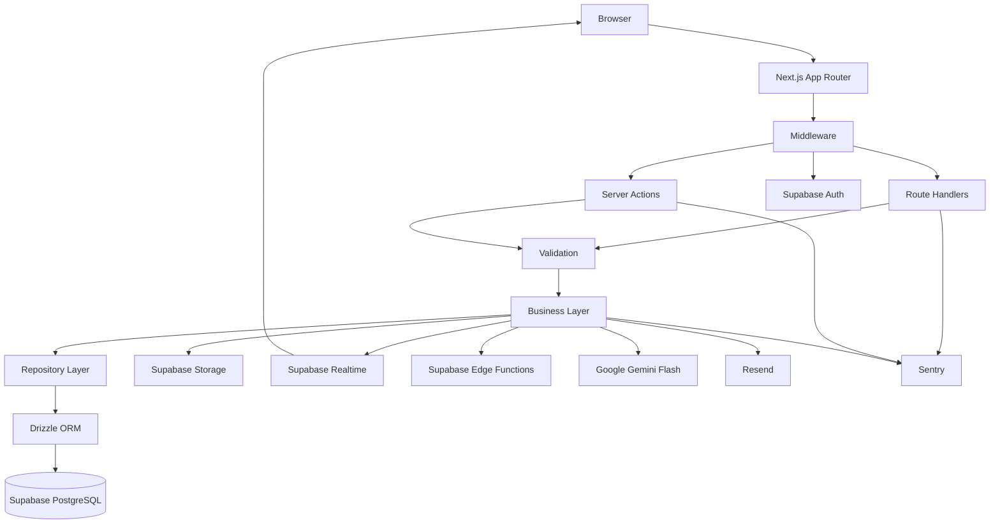

This section defines the system shape only. Detailed execution responsibilities are defined in [Section 10](04_SYSTEM_ARCHITECTURE.md#L143), request sequencing in [Section 11](04_SYSTEM_ARCHITECTURE.md#L162), and access control in [Section 13](04_SYSTEM_ARCHITECTURE.md#L182) and [Section 14](04_SYSTEM_ARCHITECTURE.md#L198).

---

## 5. Domain Architecture
The system is organized by business domains rather than by screens.

### Domain Diagram

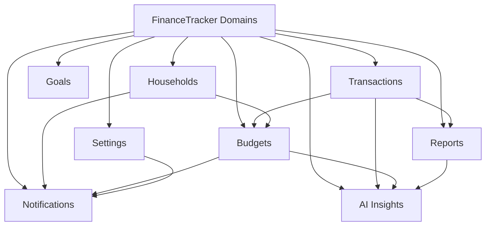

### Domain Responsibilities

| Domain | Responsibility | Primary Interactions |
|--------|----------------|----------------------|
| Transactions | Capture, classify, and retrieve financial activity | Budgets, reports, AI |
| Budgets | Define budget envelopes and status | Transactions, notifications, AI |
| Goals | Track target progress | Transactions, reports |
| Households | Shared scope, membership, roles | Budgets, notifications, realtime |
| Notifications | Alerts, summaries, reminders | Budgets, households, Edge Functions, Resend |
| AI Insights | Summaries, anomaly detection, recommendations | Transactions, budgets, reports, Gemini |
| Reports | Aggregated and exportable views | Transactions, budgets, AI |
| Settings | Preferences, profile, notification rules | Notifications, auth, storage |
Rules: domains communicate through services, shared ownership is explicit, and derived content never replaces authoritative financial records.

---

## 6. Client Architecture
The client is server-first. Hydration is limited to interactive and continuously updated views.
Client composition: App Router owns routes and layouts, Tailwind CSS plus shadcn/ui own visual composition, Zustand owns local interaction state, TanStack Query owns server-derived browser state, React Hook Form plus Zod own form capture and validation, and Sonner owns immediate feedback.

### Client Component Diagram

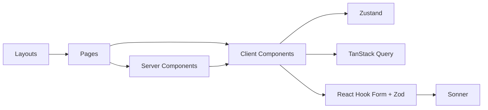

### Client Interaction Flow

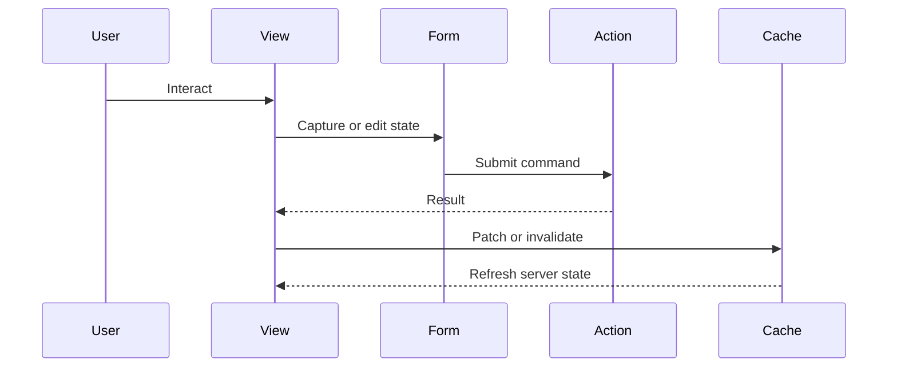

### Dashboard Structure

Dashboard modules are independently renderable and independently refreshable: account summary, budget status, transaction feed, category analysis, household activity, AI insights, and alerts. Shared widgets may subscribe to realtime; all widgets recover through revalidation or query invalidation.

---

## 7. Source Structure and Responsibility

The source layout should reflect architecture boundaries directly.

### Source Layout Diagram

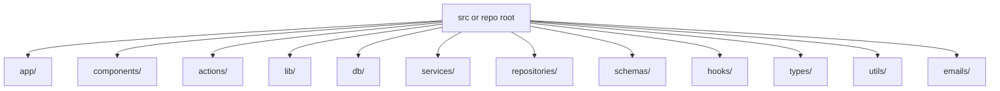

### Responsibility Table

| Path | Responsibility |
|------|----------------|
| `app/` | Routes, layouts, pages, Route Handlers, server/client rendering boundaries |
| `components/` | Reusable UI and domain-facing presentation |
| `actions/` | Server Actions used by internal mutations |
| `lib/` / `db/` | Shared runtime wiring, Drizzle config, migration support |
| `services/` | Business rules and orchestration |
| `repositories/` | Query composition, transactions, aggregates |
| `schemas/` | Zod validation contracts |
| `hooks/` | Reusable React composition |
| `types/` / `utils/` | Shared contracts and stateless helpers |
| `emails/` | Email templates and rendering support |
Structural rules: components do not import repositories, repositories do not import components, domain logic does not live in pages, and utilities remain dependency-light.

---

## 8. Dependency Rules

Dependency rules prevent architectural drift.

### Allowed Direction

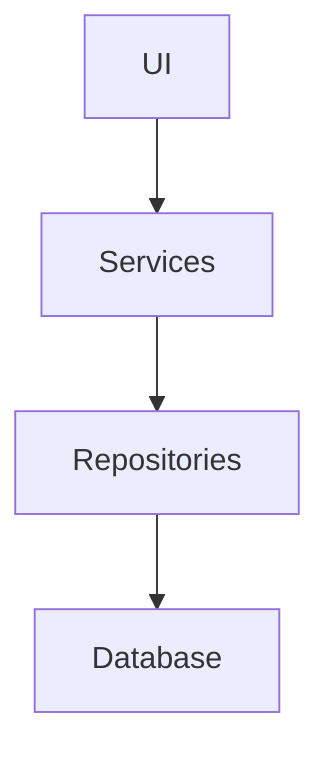
### Forbidden Direction

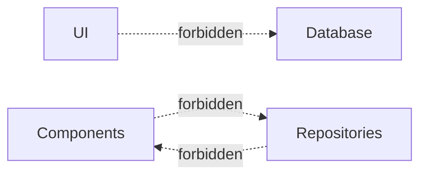

### Dependency Contract

| From | Allowed | Forbidden |
|------|---------|-----------|
| Components | Hooks, UI helpers, service-facing props/contracts | Repositories, database, provider SDKs |
| Pages and route files | Services, actions, schemas | SQL in view code |
| Server Actions | Schemas, services, cache revalidation | UI component imports, complex provider orchestration |
| Route Handlers | Schemas, services, error formatters | Components, SQL |
| Services | Repositories, adapters, domain utilities | JSX rendering, raw request parsing |
| Repositories | Drizzle, SQL helpers | Browser APIs, components |

---

## 9. Request Types

Different request classes enter through different paths.
| Request Type | Entry Path | Owner | Typical Outcome |
|--------------|-----------|-------|-----------------|
| Read | Route Handler or server-rendered loader | Query-oriented service | Response payload or rendered view |
| Mutation | Server Action or Route Handler | Command-oriented service | Persistent write and revalidation |
| Scheduled | Supabase Edge Function | Background service | Batch evaluation, summaries, notifications |
| AI | AI service path | AI orchestration service | Validated insight payload |
| File upload | Storage service path | Storage-aware service | Stored object and metadata record |
Rules: Route Handlers own explicit HTTP contracts, Server Actions own view-coupled mutations, Edge Functions own scheduled work, AI paths isolate provider latency, and storage paths isolate object management from the browser.

---

## 10. Server Architecture

Server execution is centered on shared services rather than duplicated route logic.

### Layer Table

| Layer | Responsibility | Excludes |
|-------|----------------|----------|
| Middleware | Session gating, redirects, security headers, coarse rate controls | Domain orchestration |
| Route Handlers | HTTP contract handling | SQL and core business rules |
| Server Actions | Internal mutation entry path | General API contract ownership |
| Validation | Body, query, param, and provider-output validation | Persistence |
| Business Layer | Domain rules, orchestration, cross-entity coordination | Raw request parsing |
| Repository Layer | Persistence, transactions, aggregate queries | UI rendering |
| Integration Layer | Auth, storage, realtime, AI, email, telemetry adapters | Domain ownership |

### Layer Diagram

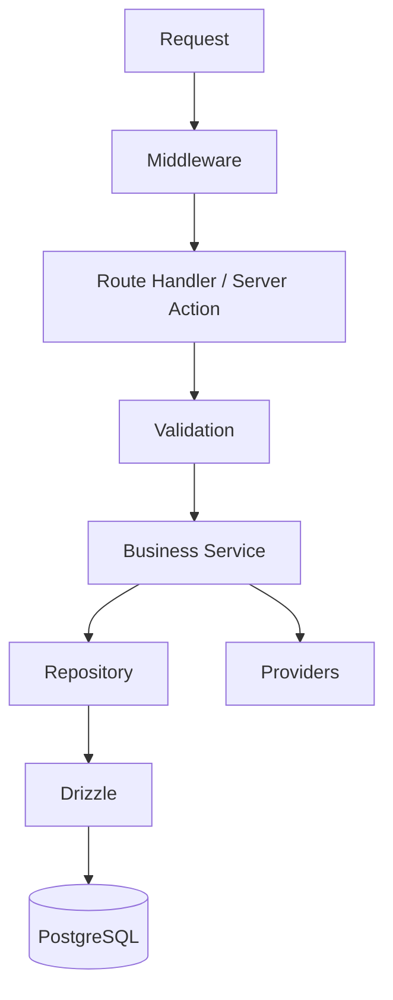

This service boundary is defined once here and referenced throughout the rest of the document.

---

## 11. Runtime Sequence

The standard runtime path is shared across most features.

### Runtime Sequence Diagram

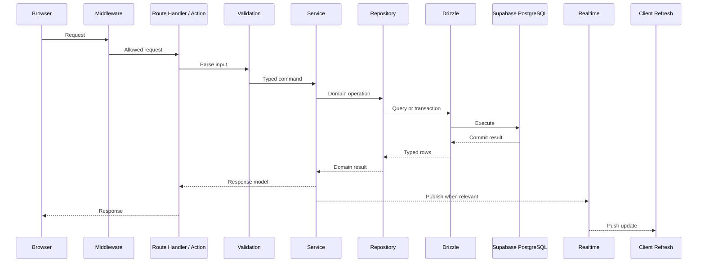

Invariants: validation precedes services, authorization precedes protected writes, side effects follow successful domain conditions, and realtime follows committed state.

---

## 12. Request Lifecycle

Every request follows the same control pattern regardless of feature: session enforcement, input validation, authorization, service execution, persistence, and response shaping. The canonical execution path is defined in [Section 11](04_SYSTEM_ARCHITECTURE.md#L162), while authentication and authorization branches are detailed in [Section 13](04_SYSTEM_ARCHITECTURE.md#L182) and [Section 14](04_SYSTEM_ARCHITECTURE.md#L198). Error propagation and reliability behavior are defined in [Section 22](04_SYSTEM_ARCHITECTURE.md#L324).
Lifecycle invariants remain unchanged: no domain logic on raw input, no protected mutation without authorization, no side effect before successful primary write, and no client assumption of success.

---

## 13. Authentication Architecture

Supabase Auth manages sign-in, sign-up, session issuance, refresh, recovery, and verification.
| Concern | Mechanism |
|---------|-----------|
| Identity and sign-in | Supabase Auth |
| Session token | JWT-backed |
| Browser continuity | Cookies |
| Protected route enforcement | Middleware |
| Server identity context | Session validation + user context |
| Password reset and verification | Provider-backed flows |

### Authentication Sequence

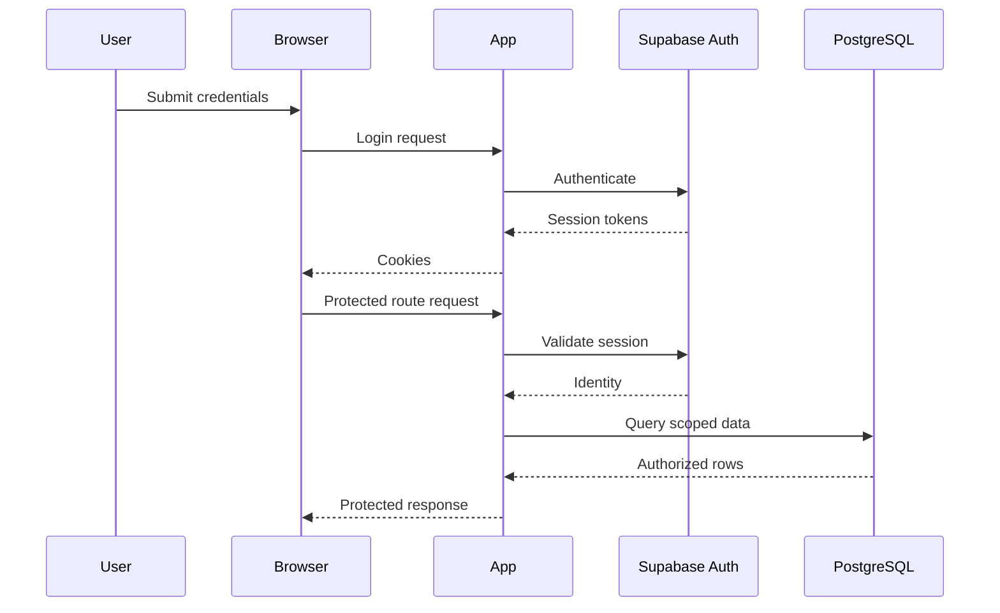

### Login Flowchart

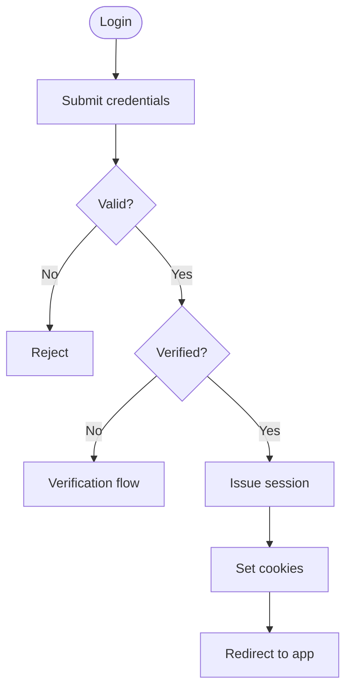

### Session Lifecycle

```mermaid
stateDiagram-v2
    [*] --> Anonymous; Anonymous --> Authenticating; Authenticating --> Active: Success; Authenticating --> Anonymous: Failure; Active --> Refreshed: Refresh; Refreshed --> Active; Active --> Recovery: Reset initiated; Recovery --> Active: Reset success; Active --> SignedOut: Logout; SignedOut --> Anonymous; Active --> Expired: Refresh fails; Expired --> Anonymous
```

Controls: protected routes deny by default without a valid session, provider tokens are revalidated server-side, and identity alone never grants resource access.

---

## 14. Authorization Architecture
Authorization is enforced in services for behavior and in PostgreSQL through RLS for data scope.

### Roles

| Role | Scope |
|------|-------|
| Owner | Full household authority |
| Admin | Operational manager within household policy |
| Member | Standard participant |
| Viewer | Read-only or read-mostly participant |

### Permission Matrix

| Capability | Owner | Admin | Member | Viewer |
|------------|-------|-------|--------|--------|
| View personal data | Yes | Yes | Yes | Yes |
| Manage personal transactions | Yes | Yes | Yes | Limited |
| View shared dashboard | Yes | Yes | Yes | Yes |
| Create shared budget | Yes | Yes | No | No |
| Edit shared budget | Yes | Yes | Limited | No |
| Invite members | Yes | Policy-based | No | No |
| Remove members | Yes | No | No | No |
| Change roles | Yes | No | No | No |
| Export shared data | Yes | Yes | Limited | No |
| Access admin settings | Yes | Limited | No | No |

### Access Control Flowchart

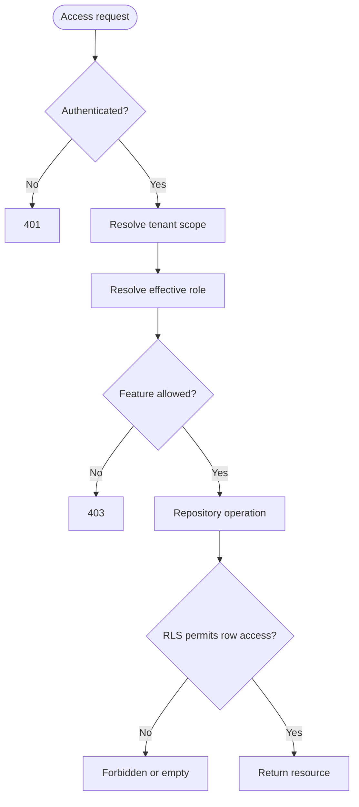

Rules: UI visibility is not security, service checks guard behavior, and RLS guards final data boundaries.

---

## 15. Database Architecture

Supabase PostgreSQL is the durable system of record for financial and collaboration state.

### Persistence Model

| Layer | Responsibility |
|------|----------------|
| Schema | Tables, keys, constraints, indexes, RLS policies |
| Drizzle | Typed query and transaction execution |
| Repository | Domain-oriented persistence and aggregate access |

### ER Overview

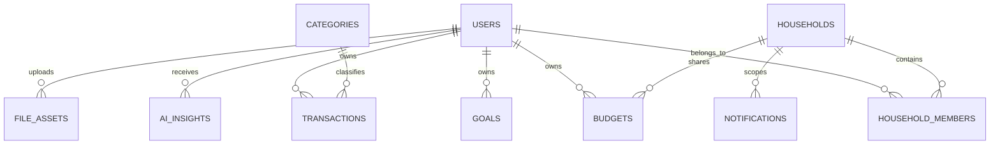

### Query and Transaction Views

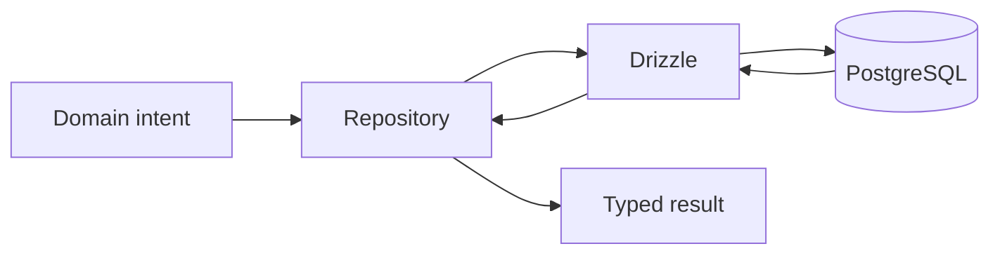

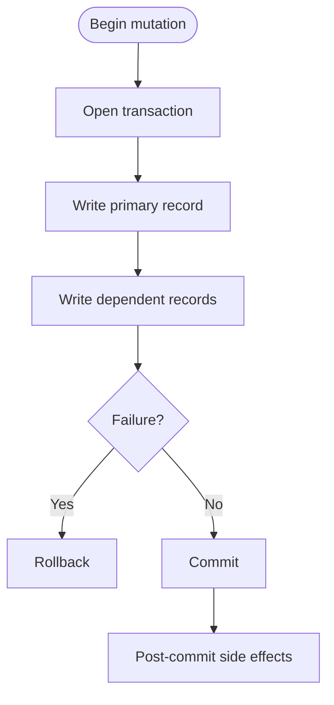

### Index Strategy

| Access Pattern | Index Shape |
|----------------|------------|
| User transaction history | `user_id + date` |
| Household membership resolution | `household_id + role` |
| Budget status lookup | `budget_id + period` |
| Notification dispatch | `state + scheduled_at` |
| AI insight reuse | `cache_key + expires_at` |

Rules: repositories expose domain operations, entry points do not contain SQL, and authorization policy remains outside repository implementation details.

---

## 16. Data Ownership

Explicit ownership keeps maintenance predictable.

| Data Type | Owner Service | Primary Store | Notes |
|-----------|---------------|---------------|-------|
| Transactions | Transaction Service | PostgreSQL | Authoritative financial activity |
| Budgets | Budget Service | PostgreSQL | Personal or household-scoped |
| Goals | Goal Service | PostgreSQL | Progress derives from financial state |
| Households | Household Service | PostgreSQL | Membership and roles |
| Notifications | Notification Service | PostgreSQL plus provider state | Durable state separate from toasts |
| AI Insights | AI Service | PostgreSQL cache | Derived, replaceable, non-authoritative |
| Files | Storage Service | Storage plus metadata table | Ownership enforced by metadata and policy |
| Settings | Settings Service | PostgreSQL | Preferences and user-level configuration |

Ownership rules: each record family has one dominant service owner, cross-domain reads pass through service contracts, and derived data never replaces authoritative transactional state.

---

## 17. AI Architecture

AI capabilities are isolated from core write correctness and treated as derived enrichments.

### AI Pipeline

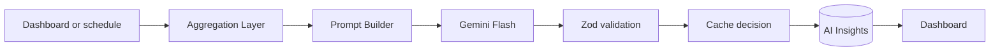

### AI Sequence

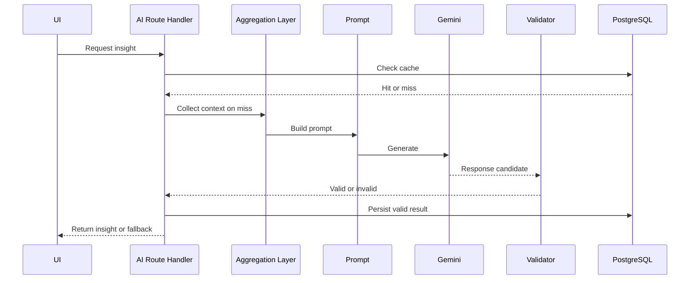

### AI Controls

| Concern | Strategy |
|---------|----------|
| Context building | Aggregate deterministic financial context before generation |
| Validation | Require schema validation before display or persistence |
| Caching | Reuse by scope, insight type, time range, and freshness marker |
| Failure handling | Use cache or deterministic fallback |
| Isolation | AI never owns transaction correctness |
Fallback order: fresh cache, stale cache with degraded freshness marker, deterministic summary, then non-blocking suppression.

---

## 18. Notification Architecture

Notifications are generated from business conditions and delivered outside interactive latency paths where possible.

### Notification Pipeline

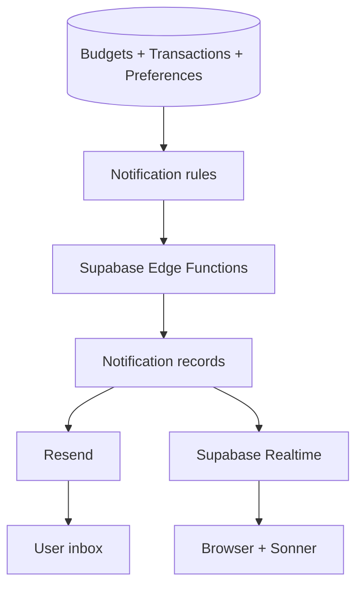

### Notification Model

| Type | Source |
|------|--------|
| Budget threshold alert | Budget and transaction status |
| Weekly summary | Scheduled aggregation and optional AI enrichment |
| Goal reminder | Goal and progress state |
| Household activity notice | Shared-state changes |
Rules: budget alerts derive from thresholds and projections, weekly summaries execute through scheduled jobs, delivery state is durable, and in-app toast state remains transient.

---

## 19. Realtime Architecture

Realtime is used only where shared-state visibility materially improves coordination.

### Realtime Sequence

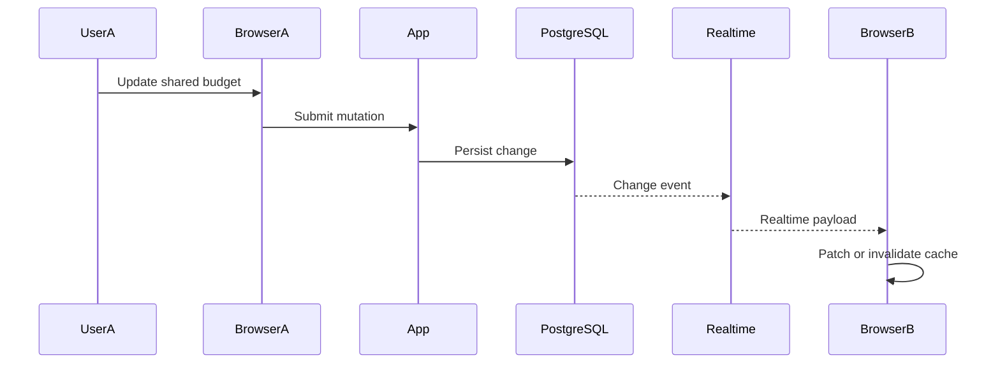

Realtime rules: database commit is authoritative, realtime is advisory and may lag, subscriptions are scoped narrowly by household, and query refetch remains the reconciliation path for critical shared views.

---

## 20. File Storage Architecture
Supabase Storage manages uploaded assets and generated files.

| Storage Class | Example Assets | Access Model |
|---------------|----------------|--------------|
| Private buckets | Receipts, exports, sensitive generated files | Signed URLs only |
| Public buckets | Profile images and explicitly low-sensitivity assets | Public read when intended |

### Upload Lifecycle

```mermaid
flowchart TD
    Start([File selected]) --> Validate[Validate metadata]; Validate --> Allowed{Authorized?}; Allowed -- No --> Reject[Reject]; Allowed -- Yes --> Upload[Upload to Storage]; Upload --> Persist[Persist asset metadata]; Persist --> Access[Issue signed URL or path]; Access --> UI[Update UI]
```

Rules: object presence does not imply access entitlement, metadata remains the ownership source of truth, and private access uses short-lived signed URLs.

---

## 21. Cross-Cutting Concerns

Cross-cutting concerns apply to every domain and entry path.
| Concern | Primary Enforcement Point |
|---------|---------------------------|
| Authentication | Middleware plus auth adapter |
| Authorization | Services plus RLS |
| Logging | Entry points and provider adapters |
| Validation | Zod schemas at every trust boundary |
| Caching | TanStack Query, AI cache, aggregate reuse |
| Monitoring | Sentry and operational dashboards |
| Rate limiting | Middleware and sensitive endpoints |
| Configuration | Environment-scoped configuration |
| Error handling | Service and entry-point normalization |

Rule: if a concern appears in multiple domains, it should be implemented through shared mechanisms instead of repeated feature-specific copies unless a domain override is justified.

---

## 22. Error Handling Architecture

Errors propagate through predictable layers so failures remain diagnosable and user-safe.

### Error Propagation Diagram

```mermaid
flowchart TD
    DBError[Database Error] --> Repo[Repository] --> Service[Service] --> Entry[Route Handler / Server Action] --> Formatter[Error Formatter] --> Client[Client]
```

### Error Categories and Reliability Controls

| Concern | Strategy |
|---------|----------|
| Validation errors | Return structured user-safe responses |
| Authentication or authorization failures | Return 401, 403, or scoped denial |
| Persistence failures | Roll back and return stable failure response |
| External-service failures | Retry only when safe and capture provider context |
| Internal unexpected failures | Capture with Sentry and fail safely |
| Retries | Idempotent provider calls only |
| Fallbacks | Cached or deterministic alternatives |
| Timeouts | Bound long-running provider interactions |
| Graceful degradation | Keep core finance workflows operational |
| Circuit protection | Suppress repeated expensive provider failures |

---

## 23. Security Architecture

Security is a layered system property rather than a single module.

### Security Flow Diagram

```mermaid
flowchart TD
    Browser[Browser] --> HTTPS[HTTPS] --> MW[Middleware] --> Session[Session validation] --> Authz[Authorization] --> Input[Input validation] --> Service[Business logic] --> RLS[Postgres RLS] --> Data[(Protected data)]; Service --> Output[Output validation or filtering]
```

### Security Controls

| Control | Enforcement |
|---------|-------------|
| Transport security | HTTPS and secure cookies |
| Identity enforcement | Supabase Auth plus middleware |
| Feature access | Service-level RBAC |
| Data access | RLS policies |
| Input safety | Zod validation |
| Secrets isolation | Environment scoping and server-only credentials |
| Abuse control | Rate limiting on AI, recovery, and export paths |
| Storage scope | Policies aligned with record ownership |
---

## 24. Scalability, Performance, and Reliability Strategy

The system scales by tightening execution paths before adding new infrastructure tiers.

### Scale Stages

| Stage | Focus |
|-------|-------|
| Today | Platform-managed scaling and architectural simplicity |
| 100 users | Query hygiene, cache discipline, notification verification |
| 1,000 users | Better aggregates, stronger observability, wider async execution |
| 10,000 users | Read optimization, connection management, batching, heavier background work |
| Future | Worker tier, event-driven pipelines, projections when justified |

### Performance Strategy

| Strategy | Application |
|----------|-------------|
| Caching | TanStack Query, AI cache, report aggregate reuse |
| Database indexes | Hot query optimization |
| Server Components | Reduced hydration cost |
| Streaming | Faster initial shell delivery |
| Lazy loading | Delay non-critical client code |
| Pagination and debouncing | Bounded list retrieval and reduced unnecessary fetches |
| Batch queries | Lower round-trip count for aggregate reads |

### Reliability Strategy

| Strategy | Application |
|----------|-------------|
| Retries | Safe provider retries only |
| Fallbacks | Cached or deterministic alternatives |
| Timeouts | Bound provider interactions |
| Graceful degradation | AI, email, and realtime fail independently of core writes |
| Provider isolation | Optional services never own transaction correctness |

---

## 25. Deployment Architecture

Deployment is Git-driven, environment-specific, and preview-friendly.

### CI/CD Diagram

```mermaid
flowchart LR
    GH[GitHub] --> CI[GitHub Actions] --> Preview[Vercel Preview]; CI --> Prod[Vercel Production]; Prod --> App[Next.js App]; App --> Supabase[Supabase]; App --> Sentry[Sentry]
```

### Deployment Model

| Stage | Responsibility |
|-------|----------------|
| GitHub | Source of truth for code and PR workflows |
| GitHub Actions | Lint, type-check, test, and release automation |
| Vercel | Preview and production application hosting |
| Supabase | Persistent platform services |

Environments: local, preview, production. Release rules: every production deployment originates from version-controlled code, preview environments validate integration flows before merge, and secrets remain environment-scoped.

---
## 26. Monitoring & Observability

Observability supports diagnosis, performance control, and operational confidence.

| Concern | Mechanism |
|---------|-----------|
| Exceptions | Sentry error capture |
| Tracing | Sentry performance traces |
| Structured logs | Entry-point and service logging with request context |
| Metrics | Latency, error rates, provider failures, query performance |
| Alerts | 5xx spikes, auth anomalies, AI failure spikes, delivery degradation |
| Health | App responsiveness, DB availability, scheduled job completion |

Key metrics: request latency by route, mutation failure rate, AI success and fallback rate, email delivery success rate, realtime subscription failure rate, and database query latency on hot paths.

---

## 27. Technology Interaction Matrix

| Technology | Interacts With | Contract or Channel | Purpose |
|------------|----------------|---------------------|---------|
| Next.js App Router | Browser, Tailwind, shadcn/ui, Zustand, TanStack Query, Sonner | HTML, RSC payloads, hooks, component composition | UI delivery and interaction composition |
| Route Handlers | Zod, business services | HTTP request validation and service invocation | Explicit API orchestration |
| Server Actions | React Hook Form, Zod, business services | Form contract and command invocation | Internal mutations |
| Business services | Drizzle, Auth, Storage, Realtime, Gemini, Resend, Sentry | In-process calls and provider adapters | Domain orchestration |
| Drizzle ORM | Supabase PostgreSQL | SQL over managed connection | Durable state access |
| Middleware | Supabase Auth | Cookies and JWT validation | Route protection |
| Supabase Realtime | Browser | Websocket channel | Realtime UI updates |
| Supabase Edge Functions | PostgreSQL, Resend | SQL and provider API | Scheduled work |
| GitHub Actions | Vercel, Supabase | Deployment integration and environment workflows | CI/CD |
| Vercel | Sentry | Release telemetry | Production observability |
| TypeScript | All application layers | Shared type system | Contract consistency |

Interaction rules: browser never accesses privileged database operations directly, client code never holds service-role credentials, AI and email providers are not part of the critical commit path, and realtime complements rather than replaces canonical reads.

---

## 28. System Constraints

| Area | Constraint or Assumption |
|------|--------------------------|
| Deployable | Primary deployable is a Next.js application on Vercel |
| Persistence | Core state remains in Supabase PostgreSQL |
| Platform consolidation | Auth, storage, and realtime remain in Supabase |
| Workers | No dedicated self-managed worker fleet in current milestones |
| Product correctness | Financial correctness outweighs UI novelty |
| Collaboration | Household features require strict tenant isolation |
| AI role | AI enhances but does not block core workflows |
| Team size | Small-team maintainability is required |
| Operational complexity | Infrastructure must stay proportional to maturity |
| Future channels | OCR, voice, and mobile are additive channels |

---

## 29. Future Architecture Evolution

Architecture evolves by milestone rather than through ad hoc subsystem expansion.

| Expected Addition | Architectural Impact |
|-------------------|----------------------|
| Richer household collaboration | Wider realtime use and stronger shared-state coordination |
| More scheduled intelligence | More async processing and cache discipline |
| Receipt upload preparation | Stronger file workflows and metadata policies |
| More structured alerts | Better delivery retries and preference modeling |
| Bank API integrations | Ingestion and reconciliation pipelines |
| OCR-driven receipt ingestion | Storage-triggered or scheduled extraction workflows |
| Voice capture | Alternate capture interface into the same command layer |
| Mobile clients | Heavier use of Route Handler contracts |
| Advanced AI | More batching, richer orchestration, possible dedicated AI job subsystem |
Evolution rules: preserve domain boundaries, prefer async enrichment over synchronous request inflation, and introduce new infrastructure only after optimizing query, cache, and workflow shape.

---
## 30. Architecture Decisions Summary

The decision register distinguishes present commitments from deferred and rejected directions.

| Status | Decision | Reason |
|--------|----------|--------|
| Accepted | Server Actions | Internal mutation path with low boilerplate and route-local revalidation |
| Accepted | Route Handlers | Stable HTTP boundary for explicit APIs and future clients |
| Accepted | Supabase | Unified managed platform for auth, DB, storage, realtime, and jobs |
| Accepted | Drizzle | Typed repository-level SQL access |
| Accepted | Modular monolith | Strong internal boundaries without operational fragmentation |
| Deferred | Redis | Not required until cache or coordination pressure exceeds the current model |
| Deferred | Microservices | Premature at current product and team scale |
| Deferred | Dedicated worker fleet | Edge Functions are sufficient for current scheduled workloads |
| Deferred | Read projections | Introduce only if report or dashboard load justifies them |
| Rejected | MongoDB | Poor fit for relational financial integrity requirements |
| Rejected | Redux | Unnecessary complexity for current client-state scope |
| Rejected | Express as primary backend | Duplicates concerns already handled by Next.js |

---
**Document Status:** Complete  
**Next Document:** [05_DATABASE_DESIGN.md](05_DATABASE_DESIGN.md)